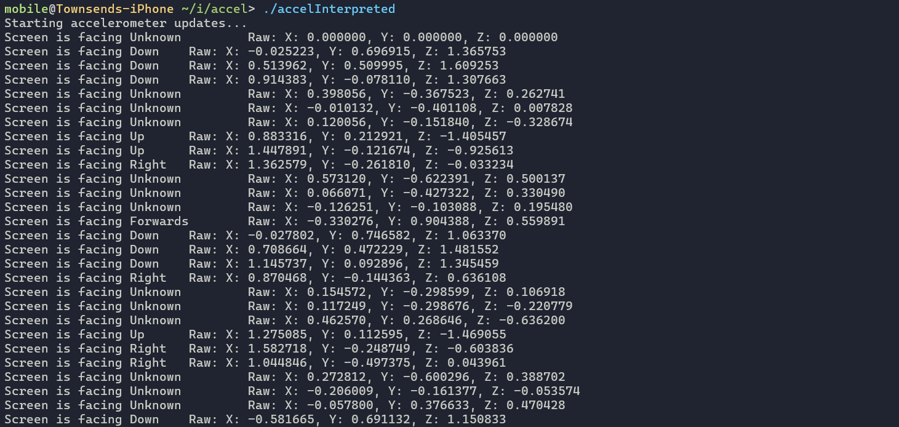

# Accel_Demo-iOS_CLI
> Simple iOS demo of reading accelerometer data to the commandline

Requires the device to be jailbroken to run. Tested on iOS 16.4.1, jailbroken with Dopamine 2.0.11. 

Developed on-device.
#### Files:
`accel_Interpreted.m`: Interprets the accelerometer data and displays the direction in which the screen is facing 
`accel_Simple.m`: Displays the raw accelerometer data
### Resources Used:
- Dopamine: [opa334/Dopamine](https://github.com/opa334/Dopamine)
- CoreMotion Documentation: [developer.apple.com/documentation/coremotion](https://developer.apple.com/documentation/coremotion)
- Theos (Build Toolchain): [theos.dev](https://theos.dev/docs/)

### Screenshot of `accel_Interpreted.m`:

